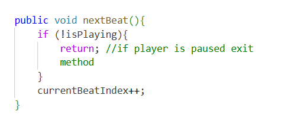
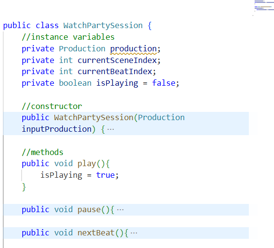
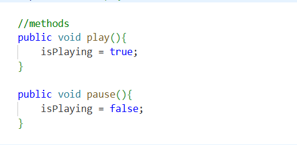
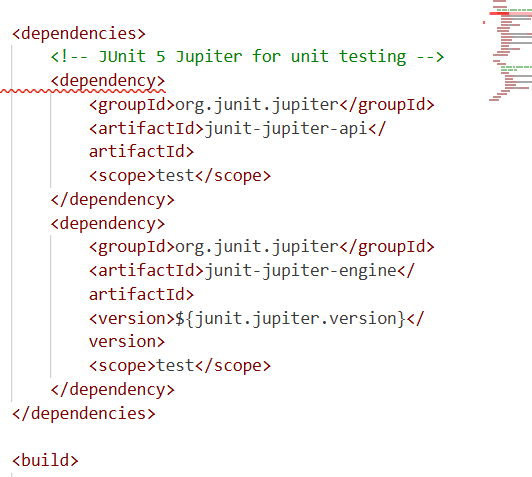

# Watch-Party-App

## Project Overview & Test Suite

### Overview
The **AI Watch Party Playback Engine** is a pure Java domain engine designed to manage media playback and maintain synchronized viewing state beat-by-beat without external frameworks.

### How It Works
The architecture models a production hierarchically:
* **Production**: Represents the full show, containing metadata and an ordered list of scenes.
* **Scene**: Represents a chapter in the production, containing scene numbers and an ordered list of beats.
* **Beat**: The atomic unit containing stage dialogue, lighting, set layout, and blocking data.
* **WatchPartySession**: Acts as the playback engine, managing play/pause state transitions, pointer positions (`currentSceneIndex`, `currentBeatIndex`), and navigation boundaries.
* **BookmarkManager**: Handles saving and restoring playback pointers so progress is not lost between sessions.

### Test Suite Breakdown
The testing suite contains 10 automated unit tests using JUnit 5, covering positive flows, negative guard clauses, boundary edge cases, and an intentional mix of assertions (`assertEquals`, `assertNotNull`, `assertTrue`, `assertFalse`):

#### 1. Beat Domain Tests (`BeatTest.java`)
* **`testBeatIdReturnsConstructorId`**: Validates the parameterized constructor correctly sets and returns the beat ID using `assertEquals`.
* **`testLyricsReturnsDialogue`**: Validates that stage dialogue text is preserved and retrieved accurately using `assertEquals`.
* **`testSetLightingUpdatesField`**: Validates field mutation by modifying stage lighting data via setter using `assertEquals`.
* **`testNoArgConstructorInitializesObject`**: Validates safe object instantiation via the default no-argument constructor using `assertNotNull`.

#### 2. Session & State Tests (`WatchPartySessionTest.java`)
* **`testIsPlayingDefaultsToFalse`**: Verifies that a new playback session initializes safely in a paused state using `assertFalse`.
* **`testPlaySetsIsPlayingToTrue`**: Verifies state transition from idle to active playback using `assertTrue`
* **`testPauseSetsIsPlayingToFalse`**: Verifies state transition from playing back to paused using `assertFalse`
* **`testNextBeatDoesNotAdvanceWhenPaused`**: Tests the guard clause negative scenario to confirm the beat pointer stays at index 0 when playback is paused using `assertEquals`.
* **`testNextBeatIncrementsIndexWhenPlaying`**: Tests the positive advancement scenario where index moves forward sequentially while playing using `assertEquals`.
* **`testPreviousBeatDoesNotDropBelowZero`**: Tests the boundary edge case ensuring index navigation stops at zero and never steps into negative indices using `assertEquals`

## Clean Code Practices

### 1. Guard Clauses (Return Early)
* **Principle**: Instead of nesting core logic inside deep `if-else` blocks, a method checks preconditions immediately and exits early using a guard clause.
* **Application**: In `WatchPartySession.java`, both `nextBeat()` and `previousBeat()` check `if (!isPlaying) return;` at the very first line. If playback is paused, execution stops immediately before attempting any index operations.
* **Why it matters**: This prevents defensive nesting, protects against state mutation during pause, and makes the normal execution path flat and easy to read.

Example from WatchPartySession.java:
public void nextBeat(){
    if (!isPlaying){
        return; // if player is paused exit method
    }
    currentBeatIndex++;
}

### 2. Meaningful Names (Intention-Revealing Names)
* **Principle**: Names should clearly reveal intent, specifying why a component exists, what it holds, and what action it performs without requiring inline comments.
* **Application**: In `WatchPartySession.java`, boolean states and pointers use descriptive naming such as `isPlaying`, `currentBeatIndex`, and `currentSceneIndex`. Methods use clear verb-noun pairings like `play()`, `pause()`, and `nextBeat()`.
* **Why it matters**: A boolean named `isPlaying` makes conditionals read like standard English (`if (!isPlaying)`), eliminating ambiguity and removing the need for explanatory comments throughout the codebase. (even tho, yeah.. I have lots of them for my mental map. But I get that in production one wouldn't do that)

Example from WatchPartySession.java
private int currentSceneIndex;
private int currentBeatIndex;
private boolean isPlaying = false;

public void play() {
    isPlaying = true;
}

### 3. Small Functions Do One Thing (Single Responsibility)
* **Principle**: Functions should remain small and execute exactly one task without hidden side effects.
* **Application**: In `WatchPartySession.java`, methods such as `play()` and `pause()` perform a single operation: toggling the `isPlaying` flag. They do not manipulate indices or manage scenes, leaving navigation strictly to `nextBeat()` and `previousBeat()`.
* **Why it matters**: Keeping functions focused eliminates hidden side effects, makes the codebase easy to reason about, and allows unit tests to test one specific behavior in total isolation.

Examples from WatchPartySession.java
public void play() {
    isPlaying = true;
}

public void pause() {
    isPlaying = false;
}

## Dependencies

### Overview
To adhere strictly to the core OOP requirements, this project avoids heavy third-party frameworks and web servers. The only external dependency utilized is **JUnit 5 (Jupiter)** for automated unit testing.

### Dependency Breakdown
* **Group ID**: `org.junit.jupiter`
* **Artifact ID**: `junit-jupiter`
* **Version**: `5.10.x` (or your specific version from `pom.xml`)
* **Scope**: `test`

Eample from pom file:
<dependency>
    <groupId>org.junit.jupiter</groupId>
    <artifactId>junit-jupiter</artifactId>
    <version>5.10.0</version>
    <scope>test</scope>
</dependency>

## Retrospective

### Git & Pull Request Workflow Management

* **The Obstacle**: Navigating a strict dev/trunk-based branching workflow (`qap1` -> `feature/*` -> Pull Request -> CI build -> merge) initially presented a challenge in tracking local vs. remote branches, staging checkpoints, and synchronizing after merges.
* **The Root Cause**: Git workflows involve multi-step command sequences where skipping or misordering a step (like forgetting to checkout the base branch or pull down remote merges) can create detached histories or merge conflicts.
* **The Solution**: To master this, I created a personal step-by-step Git workflow reference document. This runbook mapped out each phase: creating feature branches, staging atomic commits, pushing upstream, opening GitHub Pull Requests, and pulling merged changes back into the local `qap1` branch[cite: 1, 2].
* **The Outcome**: Having a clear, standardized reference eliminated confusion, resulting in clean feature branches (`feature/session-tests`, `feature/readme-docs`), seamless merges, and consistently passing GitHub Actions CI runs on every Pull Request

### Managing OOP Hierarchy & Cognitive Navigation

* **The Obstacle**: In a multi-layered object-oriented architecture (`Production` -> `Scene` -> `Beat` alongside `WatchPartySession` and `BookmarkManager`), keeping track of which class owned which method and how data moved between layers initially caused cognitive overload.
* **The Root Cause**: Working bottom-up across nested domain models means juggling multiple abstraction layers at once—such as distinguishing between reading an index from a session versus navigating through scenes to pull a specific beat ID.
* **The Solution**: To anchor my understanding, I implemented intentional "mental map" comments directly above methods and fields in the codebase. These notes explicitly mapped out the relationships, explaining in plain English where data originated and where it was being passed (e.g., mapping session getters to bookmark state)[cite: 1].
* **The Outcome**: These mental maps reduced cognitive friction, made navigating between classes intuitive, and served as clear documentation when writing unit tests and verifying state transitions.

## About The Project: The Vision

### The Big Idea
The **AI Watch Party Playback Engine** is a synchronized human/AI co-watching framework designed to enable real-time, shared media experiences with an AI co-viewer or companion. Rather than treating an AI as an external database that summarizes a show in hindsight, this engine creates a shared temporal context so human and AI experience theatrical productions and films together moment by moment.

### The Technical Problem: Context Bloat, Truncation & Loss
Standard LLM agent workflows struggle with real-time media analysis due to fundamental architectural limitations:
* **Data Scarcity & Truncated Scraping**: Raw screenplays are rarely accessible cleanly via simple web search tools, which typically return noisy, truncated webpage snapshots rather than complete scripts.
* **The "Lost in the Middle" Effect**: Stuffing an entire full-length screenplay into a prompt degrades LLM reasoning. Long context windows suffer from attention attenuation, causing the model to miss subtle character cues, lighting, and stage blocking.
* **Multi-Turn Redundancy**: In a live conversation, having an agent re-parse an entire script on every dialogue turn creates token bloat, high latency, and rapid context drift.

### The Solution: A Stateful Atomic Beat Buffer
This pure Java engine acts as a **temporal buffer and state controller**:
* **Hierarchical Chunking**: Ingests scripts structured into `Production`, `Scene`, and atomic `Beat` objects containing dialogue, lyrics, lighting, and blocking.
* **Just-In-Time Context Injection**: Instead of feeding a 100-page script at once, the engine isolates the exact current moment, supplying laser-focused scene data strictly for the active turn.
* **Stateful Playback Navigation**: Through `nextBeat()` and `previousBeat()`, the viewer maintains full directional control over playback without breaking synchronization or losing session state.

> *Note: This Java core represents Phase 1 of a multi-phase system, establishing the pure OOP domain logic and state boundaries before integrating REST APIs and LLM prompt pipelines in future QAPs and sprints.*

### Project Context & Architectural Boundaries
* **Broader System Context**: Outside of this coursework, I maintain an active, independent AI agent environment. This Java playback engine is designed as an add-on module to integrate into that pre-existing ecosystem.
* **Coursework Scope**: This project does not require building an AI or agentic framework from scratch—that architecture is already built and operational.
* **Modular Integration**:
  * **Frontend**: An existing React UI will host the co-watching controls and stage overlays.
  * **Turn Module**: A working turn-processing module already handles conversation context and prompt delivery.
  * **The Payload**: The sole responsibility of this Java application is to manage state and output an atomic beat payload that cleanly feeds into that existing turn pipeline.

